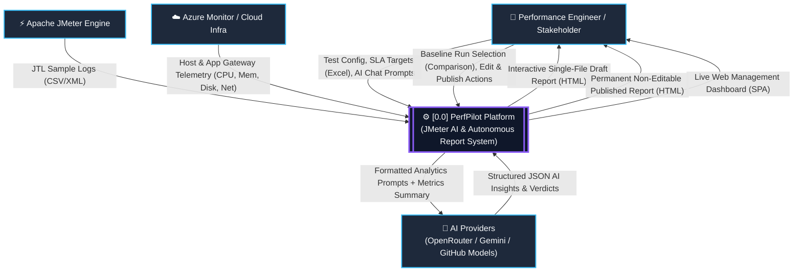
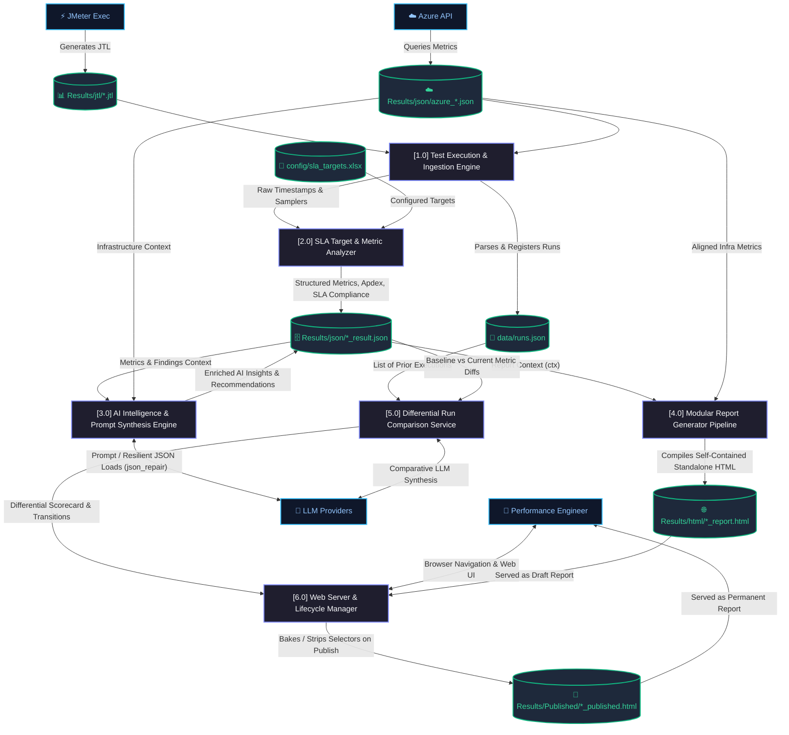
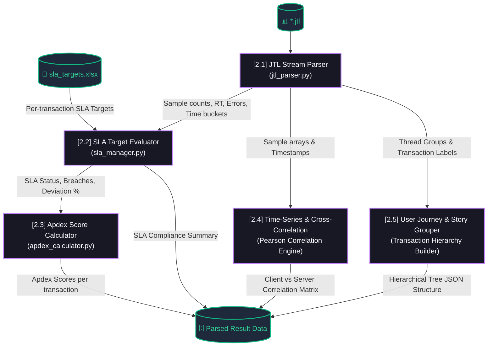
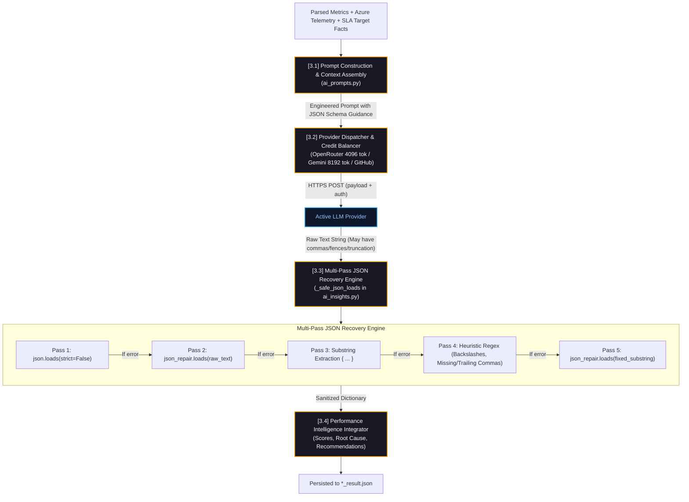
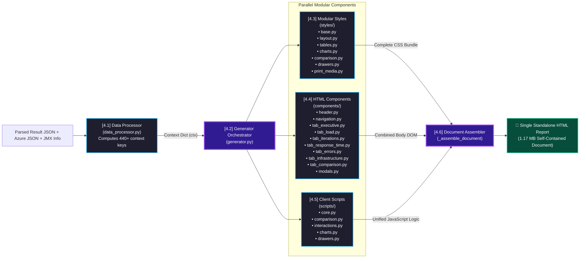
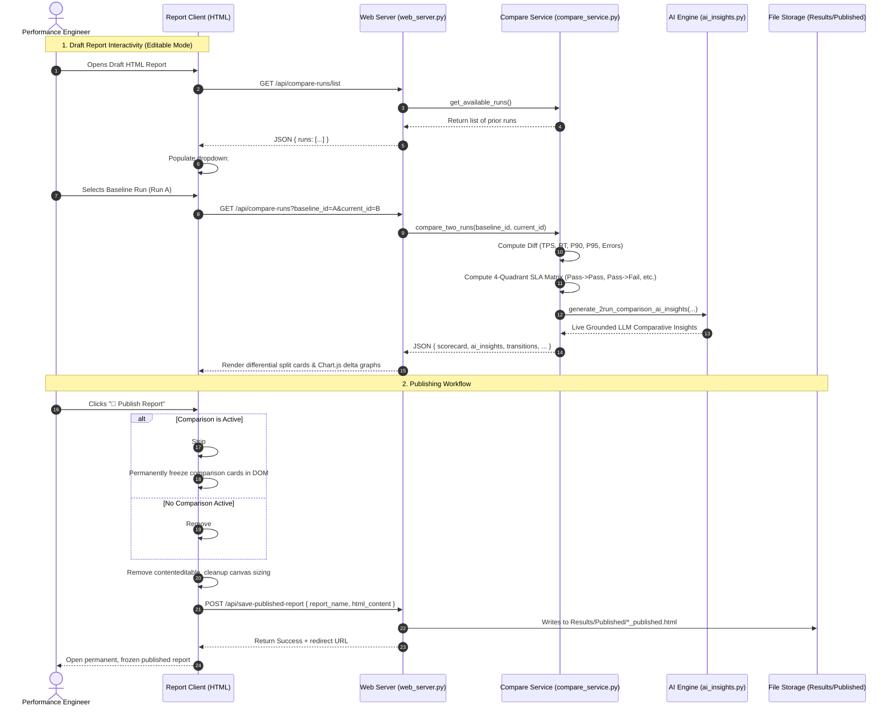

# PerfPilot System Architecture — Detailed Data Flow Diagram (DFD)

This document provides a comprehensive, multi-tiered **Data Flow Diagram (DFD)** specification for the **PerfPilot / JMeter AI** performance engineering and autonomous reporting platform.

---

## 1. DFD Level 0: Context Diagram

The Level 0 Context Diagram models the boundary of the entire PerfPilot system, identifying all external entities, inbound inputs, and outbound deliverables.

---

## 2. DFD Level 1: High-Level System Process Flow

Level 1 breaks down the platform into its 5 primary subsystems, tracing data movement between external entities, core processes, and internal datastores.

---

## 3. DFD Level 2: Detailed Sub-Process Decompositions

### 3.1 Sub-Process 2.0: Metrics Processing & Intelligence Engine

---

### 3.2 Sub-Process 3.0: AI Intelligence & Resilient Parsing Pipeline

---

### 3.3 Sub-Process 4.0: Modular Report Generator Pipeline

---

### 3.4 Sub-Process 5.0: Differential Comparison & Publishing System

---

## 4. Key Data Stores Dictionary

| Data Store | Physical Path / Format | Description | Consuming Subsystems |
|---|---|---|---|
| **D_JTL** | `Results/jtl/*.jtl` (CSV / XML) | Raw sample execution logs from JMeter runs | `[1.0]` Ingestion, `[2.1]` JTL Parser |
| **D_Azure** | `Results/json/azure_*.json` (JSON) | Azure Monitor infrastructure metrics (CPU, Memory, Disk Queue, Network I/O) | `[1.0]` Collector, `[2.4]` Correlation, `[4.1]` Data Processor |
| **D_SLA** | `config/sla_targets.xlsx` (Excel) | User-defined transaction latency and error rate SLAs | `[2.2]` SLA Evaluator, `[3.1]` Prompt Builder |
| **D_JSON** | `Results/json/*_result.json` (JSON) | Aggregated run metrics, percentiles, error breakdowns, and persisted AI insights | `[3.0]` AI Engine, `[4.1]` Data Processor, `[5.0]` Compare Service |
| **D_Runs** | `data/runs.json` (JSON) | Global catalog of all historical runs, statuses, timestamps, and test script names | `[5.0]` Compare Service, `[6.0]` Web Server |
| **D_HTML** | `Results/html/*_report.html` (HTML) | Single standalone draft interactive report with client-side comparison selector and AI chat drawer | `[6.0]` Web Server / Browser |
| **D_Pub** | `Results/Published/*_published.html` (HTML) | Permanent, read-only published report with comparisons baked in (or stripped out) and edit controls removed | Stakeholders / CI/CD Delivery |
