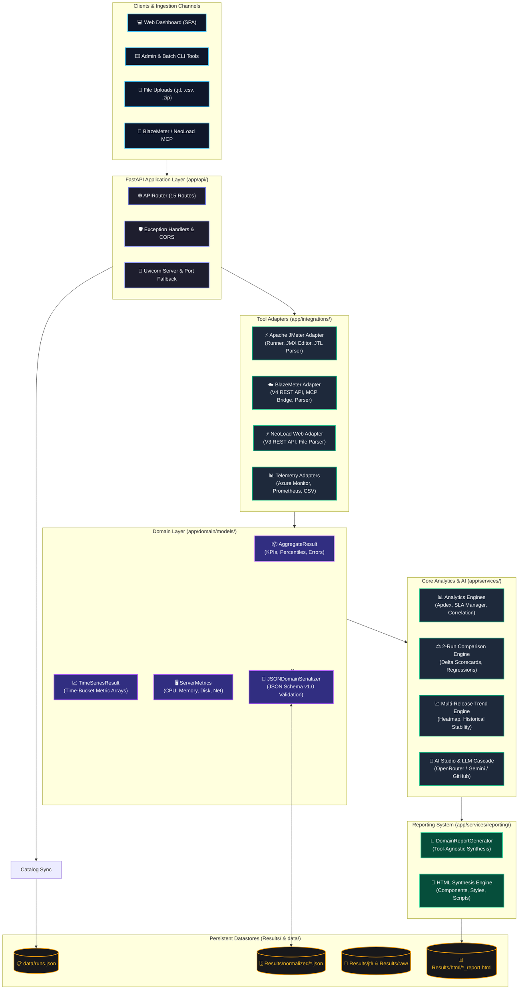
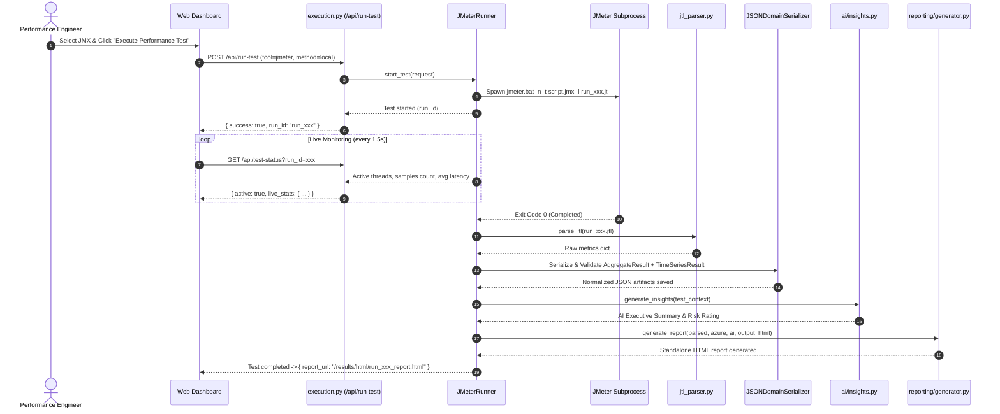
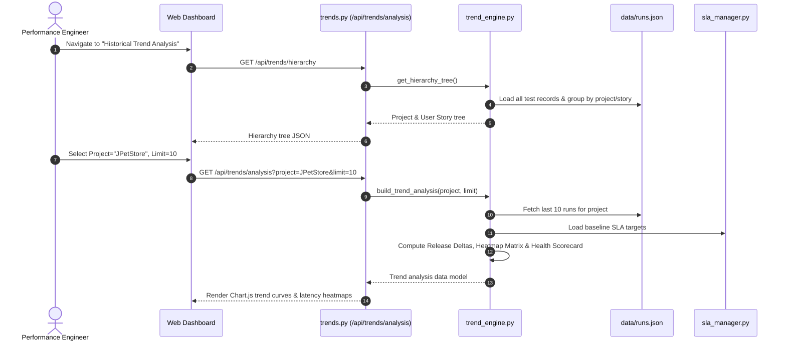

# PerfPilot Platform — Comprehensive Architecture & Technical Reference Manual

---

## 1. Executive Overview & Design Philosophy

**PerfPilot** is a production-grade, tool-agnostic performance engineering and observability platform. Originally conceived around Apache JMeter, it has been evolved into an enterprise system supporting **Apache JMeter**, **BlazeMeter Cloud**, and **NeoLoad Web**, alongside comprehensive infrastructure telemetry providers (**Azure Monitor**, **Prometheus**, and **Generic CSV Metrics**).

### Core Architectural Axioms

1. **Independent Responsibilities**:
   - **Execution**, **Collection**, **Parsing**, **Normalization**, **Analytics**, and **Reporting** are completely decoupled into dedicated packages.
   - Adding a new load testing tool (e.g., k6, Gatling) or telemetry source (e.g., Datadog, Dynatrace) requires **zero modifications** to the analytics, comparison, or reporting engines.

2. **Strongly Typed Domain Contracts (Pydantic V2)**:
   - Subsystem boundaries communicate strictly through validated domain models (`TimeSeriesResult`, `AggregateResult`, `ServerMetrics`).
   - Arbitrary dictionaries and unstructured JSON blobs are prohibited across internal APIs. JSON files stored on disk are strictly persistence/transport artifacts validated against versioned **JSON Schema (`v1.0`)** definitions.

3. **Multi-Channel Ingestion**:
   Every performance tool can ingest data through four interchangeable pathways:
   - **Local CLI Execution**: Subprocess execution with real-time status streaming.
   - **Direct REST API**: Polling and pulling completed test runs from cloud vendor endpoints.
   - **Model Context Protocol (MCP)**: Native integration with AI-orchestrated tool servers.
   - **Raw File Upload**: Drag-and-drop ingestion of `.jtl`, `.json`, `.csv`, `.zip`, and `.xml` result bundles.

---

## 2. High-Level Architecture Diagram



---

## 3. The 5 Architectural Layers

```
app/
 ├── api/             --> Layer 5: Web API & Presentation
 ├── cli/             --> Layer 5: Administrative & Command Line Utilities
 ├── services/        --> Layer 4: Analytics, AI & Report Synthesis
 ├── domain/          --> Layer 3: Domain Contracts & Schema Boundaries
 ├── serialization/   --> Layer 3: Persistence & JSON Schema Validation
 ├── integrations/    --> Layer 1: Tool Execution & Result Parsing
 ├── server_metrics/  --> Layer 1: Infrastructure Telemetry Adapters
 └── core/            --> Cross-Cutting: Config, Logging, Constants, Exceptions
```

### Layer 1: Integrations & Telemetry Adapters
Encapsulates all vendor-specific protocols, CLI parameters, and raw result formats. Converts tool-specific telemetry into generic intermediate structures.

### Layer 2: Domain Contracts & Schema Boundaries
Defines the strict contracts of the platform via Pydantic V2 models. Guarantees that no vendor-specific concepts leak into core business logic.

### Layer 3: Analytics & Intelligence Services
Independent analytical engines operating purely on domain contracts:
- Computes Apdex indices and nearest-neighbor scenario SLA tolerances.
- Computes Pearson correlation and time-lag offsets between client response time and server CPU.
- Performs 2-run differential comparisons and multi-release historical trend analysis.
- Connects to multi-provider LLM cascades to formulate natural-language executive summaries.

### Layer 4: Report Synthesis Engine
Assembles standalone, zero-dependency HTML performance reports containing embedded CSS, interactive Chart.js visualizations, SLA breach tables, and AI executive summaries.

### Layer 5: Web API & Presentation
FastAPI web framework with Swagger OpenAPI documentation (`/docs`), automated port hunting (ports 8080..8089), and responsive Single Page Application (`web/`).

---

## 4. Multi-Tool Integrations

### 1. Apache JMeter (`app/integrations/jmeter/`)

| File | Purpose |
| :--- | :--- |
| [`runner.py`](file:///d:/BlazemeterMCPZIP/JmeterAI/app/integrations/jmeter/runner.py) | Executes local JMeter tests via non-blocking subprocess (`jmeter.bat -n -t ... -l ...`). Houses a 60-second cached binary detector and a background streaming thread that reads `.jtl` samples as they are flushed. |
| [`jmx_editor.py`](file:///d:/BlazemeterMCPZIP/JmeterAI/app/integrations/jmeter/jmx_editor.py) | Modifies `.jmx` XML test plans directly using `xml.etree.ElementTree`. Updates Thread Group concurrency (`ThreadGroup.num_threads`), ramp-up (`ThreadGroup.ramp_time`), duration, and extracts Transaction Controller hierarchies. |
| [`jtl_parser.py`](file:///d:/BlazemeterMCPZIP/JmeterAI/app/integrations/jmeter/jtl_parser.py) | High-performance CSV parser for JMeter JTL logs. Extracts summary KPIs, transaction response time arrays, percentiles, error categorizations, and time series buckets. |
| [`aggregate_parser.py`](file:///d:/BlazemeterMCPZIP/JmeterAI/app/integrations/jmeter/aggregate_parser.py) | Implements `AggregateParser` interface. Transforms raw sample rows into validated `AggregateResult` models. |
| [`timeseries_parser.py`](file:///d:/BlazemeterMCPZIP/JmeterAI/app/integrations/jmeter/timeseries_parser.py) | Implements `TimeSeriesParser` interface. Buckets sample timestamps and computes rolling averages for throughput, latency, and active threads into `TimeSeriesResult`. |

### 2. BlazeMeter Cloud (`app/integrations/blazemeter/`)

| File | Purpose |
| :--- | :--- |
| [`api_client.py`](file:///d:/BlazemeterMCPZIP/JmeterAI/app/integrations/blazemeter/api_client.py) | Interacts directly with BlazeMeter REST API v4 (`https://a.blazemeter.com/api/v4`). Handles authentication via API Key/Secret, starts cloud tests, polls master status (`GET /masters/{id}/status`), and downloads aggregate reports (`/masters/{id}/reports/aggregate`). |
| [`mcp_source.py`](file:///d:/BlazemeterMCPZIP/JmeterAI/app/integrations/blazemeter/mcp_source.py) | Subagent MCP bridge communicating with BlazeMeter MCP tool servers. Invokes lazy-loaded tools (`blazemeter_tests`, `blazemeter_execution`). |
| [`aggregate_parser.py`](file:///d:/BlazemeterMCPZIP/JmeterAI/app/integrations/blazemeter/aggregate_parser.py) | Normalizes BlazeMeter JSON responses into `AggregateResult`. Maps BlazeMeter summary metrics (`avgResponseTime`, `samples`, `errorsCount`, `p90`, `p95`) to standard contracts. |
| [`timeseries_parser.py`](file:///d:/BlazemeterMCPZIP/JmeterAI/app/integrations/blazemeter/timeseries_parser.py) | Transforms BlazeMeter timeline data points (`GET /masters/{id}/reports/default/timeline`) into normalized `TimeSeriesResult`. |

### 3. NeoLoad Web (`app/integrations/neoload/`)

| File | Purpose |
| :--- | :--- |
| [`api_client.py`](file:///d:/BlazemeterMCPZIP/JmeterAI/app/integrations/neoload/api_client.py) | Connects to NeoLoad Web API v3 (`https://neoload-api.saas.neotys.com/v3`). Queries workspaces, tests, and test results, starting test execution and polling test completion. |
| [`file_parser.py`](file:///d:/BlazemeterMCPZIP/JmeterAI/app/integrations/neoload/file_parser.py) | Parses uploaded NeoLoad XML and CSV export files into standardized dictionary representations. |
| [`aggregate_parser.py`](file:///d:/BlazemeterMCPZIP/JmeterAI/app/integrations/neoload/aggregate_parser.py) | Normalizes NeoLoad element statistics (`/v3/workspaces/{w}/test-results/{r}/elements`) into `AggregateResult`. |
| [`timeseries_parser.py`](file:///d:/BlazemeterMCPZIP/JmeterAI/app/integrations/neoload/timeseries_parser.py) | Transforms NeoLoad metric point arrays into standardized `TimeSeriesResult`. |

### 4. Server Metrics & Telemetry Providers (`app/server_metrics/`)

| Provider | Path | Capabilities |
| :--- | :--- | :--- |
| **Azure Monitor** | `app/server_metrics/azure/` | Uses `azure-identity` (`DefaultAzureCredential`) and `azure-monitor-query` (`MetricsQueryClient`) to collect CPU, Memory, Disk IOPS, Network In/Out, and App Service HTTP 5xx responses. Includes built-in demo fallback (`mock_azure_metrics.json`). |
| **Prometheus** | `app/server_metrics/prometheus/` | Queries Prometheus range vectors (`/api/v1/query_range`) with customizable PromQL queries for `node_cpu_seconds_total`, `node_memory_MemAvailable_bytes`, and disk/network rates. |
| **CSV Telemetry** | `app/server_metrics/csv/` | Parses generic server metrics CSV files (timestamp, cpu, memory, disk, network) for offline and on-premise monitoring setups. |

---

## 5. Strongly Typed JSON Formats & Schema Contracts

All domain models are located in [`app/domain/models/`](file:///d:/BlazemeterMCPZIP/JmeterAI/app/domain/models/) and exported as JSON Schema specifications in [`schemas/`](file:///d:/BlazemeterMCPZIP/JmeterAI/schemas/).

### Contract 1: `AggregateResult` (`schemas/aggregate.schema.json`)
Represents the total performance summary of a test run across all transactions.

```json
{
  "schema_version": "1.0",
  "test_id": "run_20260909_172954",
  "test_name": "JPetStore_LoadTest",
  "tool": "jmeter",
  "total_samples": 4800,
  "summary": {
    "total": 4800,
    "passed": 4650,
    "errors": 150,
    "error_rate": 3.12,
    "avg_rt": 342.5,
    "min_rt": 45.0,
    "max_rt": 2450.0,
    "median_rt": 280.0,
    "p90": 512.0,
    "p95": 780.0,
    "p99": 1250.0,
    "throughput_tps": 80.0,
    "duration_sec": 60.0
  },
  "transactions": {
    "TC01_Launch": {
      "count": 1200,
      "errors": 0,
      "error_rate": 0.0,
      "avg_rt": 120.4,
      "min_rt": 45.0,
      "max_rt": 350.0,
      "median_rt": 110.0,
      "p90": 180.0,
      "p95": 210.0,
      "p99": 280.0,
      "throughput": 20.0
    }
  },
  "errors": {
    "HTTP 500": {
      "count": 120,
      "error_type": "HTTP 500 Internal Server Error",
      "occurrences": [
        {
          "timestamp": "2026-09-09T17:30:15Z",
          "label": "TC03_Checkout",
          "response_code": "500",
          "message": "Database connection pool timeout"
        }
      ]
    }
  }
```

> [!NOTE]
> **Two-Way Key Normalization & Transaction Hierarchy**:
> - **Field Aliasing**: The platform maintains seamless compatibility between Pydantic V2 models (`avg_response_time`, `duration_seconds`, `total_requests`, `failed_requests`) and historical/legacy JSON keys (`avg_rt`, `duration_sec`, `total`, `errors`).
> - **Hierarchy**: In `transactions`, entries represent either top-level business user transactions (`depth: 0`, e.g. `TC01_Launch`) or child HTTP requests (`depth: 1`). SLA evaluation and compliance rates are strictly computed against parent business transactions (`depth == 0`), ensuring request-level child calls do not distort SLA scores.

### Contract 2: `TimeSeriesResult` (`schemas/timeseries.schema.json`)
Represents time-bucketed performance telemetry across test execution.

```json
{
  "schema_version": "1.0",
  "test_id": "run_20260909_172954",
  "tool": "jmeter",
  "bucket_seconds": 5,
  "timestamps": [
    "17:30:00",
    "17:30:05",
    "17:30:10",
    "17:30:15"
  ],
  "active_threads": [10, 25, 50, 50],
  "response_times": [120.5, 210.3, 450.1, 380.2],
  "throughput": [15.2, 38.4, 78.5, 80.2],
  "error_counts": [0, 0, 5, 2],
  "transactions": {
    "TC01_Launch": {
      "timestamps": ["17:30:00", "17:30:05"],
      "response_times": [110.2, 125.4],
      "throughput": [5.0, 10.0]
    }
  }
}
```

### Contract 3: `ServerMetrics` (`schemas/server_metrics.schema.json`)
Represents normalized server-side resource metrics.

```json
{
  "schema_version": "1.0",
  "provider": "azure_monitor",
  "configured": true,
  "infra_summary": {
    "avg_cpu": 45.2,
    "max_cpu": 88.4,
    "avg_memory": 62.1,
    "max_memory": 71.0,
    "avg_network_in_mbps": 12.5,
    "avg_network_out_mbps": 35.8,
    "avg_disk_read_iops": 120.0,
    "avg_disk_write_iops": 450.0,
    "http_5xx_errors": 150,
    "app_avg_rt_ms": 185.2
  },
  "time_series": {
    "timestamps": ["2026-09-09T17:30:00Z", "2026-09-09T17:31:00Z"],
    "cpu": [35.0, 55.4],
    "memory": [60.0, 64.2],
    "network_in": [10.2, 14.8],
    "network_out": [28.5, 43.1]
  },
  "resources_queried": [
    "/subscriptions/.../resourceGroups/.../providers/Microsoft.Compute/virtualMachines/vm-prod-01"
  ]
}
```

### Contract 4: Historical Run Manifest (`data/runs.json`)
Stores the catalog of all completed runs:

```json
{
  "runs": [
    {
      "id": "run_20260909_172954",
      "test_name": "JPetStore_MultiUserStories",
      "timestamp": "2026-09-09 17:29:54",
      "tool": "jmeter",
      "users": 10,
      "duration": 60,
      "samples": 4800,
      "error_rate": 3.12,
      "avg_rt": 342.5,
      "p90": 512.0,
      "throughput": 80.0,
      "result_file": "run_20260909_172954_result.json",
      "report_file": "run_20260909_172954_report.html",
      "has_ai_insights": true
    }
  ]
}
```

---

## 6. Complete File-by-File Catalog

### 1. Web Application Layer (`app/api/`)

- [`app.py`](file:///d:/BlazemeterMCPZIP/JmeterAI/app/api/app.py): Application factory setting up CORS middleware, mounting static UI assets from `web/`, and registering all 9 modular route controllers.
- [`server.py`](file:///d:/BlazemeterMCPZIP/JmeterAI/app/api/server.py): Production server runner wrapping Uvicorn with automated port hunting (checks ports 8080..8089 and binds to the first free socket).
- [`middleware/error_handler.py`](file:///d:/BlazemeterMCPZIP/JmeterAI/app/api/middleware/error_handler.py): Central exception handler translating `PerfPilotError`, `TestExecutionError`, and `ValidationError` into clean JSON responses with RFC-compliant error schemas.

#### Route Controllers (`app/api/routes/`):
- [`status.py`](file:///d:/BlazemeterMCPZIP/JmeterAI/app/api/routes/status.py): Health check endpoint (`/api/status`), reports availability of JMeter, BlazeMeter, NeoLoad, Azure Monitor, and active AI model.
- [`tests.py`](file:///d:/BlazemeterMCPZIP/JmeterAI/app/api/routes/tests.py): Manages test scripts (`/api/tests`), JMX parameters (`/api/jmx-config`), file uploads (`/api/upload-jmx`), and scenario SLA configurations (`/api/sla`).
- [`execution.py`](file:///d:/BlazemeterMCPZIP/JmeterAI/app/api/routes/execution.py): Orchestrates test execution (`/api/run-test`), live polling during execution (`/api/test-status`), and abortion (`/api/stop-test`).
- [`ingestion.py`](file:///d:/BlazemeterMCPZIP/JmeterAI/app/api/routes/ingestion.py): Handles multi-tool data ingestion: raw file uploads (`/api/ingest/upload`), direct REST API pulls (`/api/ingest/api`), and MCP server queries (`/api/ingest/mcp`).
- [`runs.py`](file:///d:/BlazemeterMCPZIP/JmeterAI/app/api/routes/runs.py): Manages historical catalog (`/api/runs`), run deletion (`/api/delete-run`), and batch recompilations (`/api/recompile-reports`).
- [`compare.py`](file:///d:/BlazemeterMCPZIP/JmeterAI/app/api/routes/compare.py): Executes 2-run differential comparisons (`/api/comparison/data`), generates delta percentiles, and persists comparison draft states.
- [`trends.py`](file:///d:/BlazemeterMCPZIP/JmeterAI/app/api/routes/trends.py): Computes multi-release KPI trend matrices (`/api/trends/analysis`), project/story hierarchies, and renders standalone trend dashboards.
- [`ai_studio.py`](file:///d:/BlazemeterMCPZIP/JmeterAI/app/api/routes/ai_studio.py): Powers the interactive AI Studio: prompt previews (`/api/ai-studio/prompt-preview`), LLM generation (`/api/ai-studio/generate`), and chat interactions.
- [`reports.py`](file:///d:/BlazemeterMCPZIP/JmeterAI/app/api/routes/reports.py): Manages HTML reports (`/api/reports`), opening reports in the browser, and publishing permanent, non-editable report archives.

---

### 2. Core Utilities (`app/core/`)

- [`config.py`](file:///d:/BlazemeterMCPZIP/JmeterAI/app/core/config.py): Environment settings manager loading `.env` variables (e.g. `HOST`, `PORT`, `JMETER_HOME`, `JAVA_HOME`, `AZURE_*`, `OPENROUTER_API_KEY`, `GEMINI_API_KEY`).
- [`constants.py`](file:///d:/BlazemeterMCPZIP/JmeterAI/app/core/constants.py): Canonical filesystem directory definitions (`ROOT_DIR`, `CONFIG_DIR`, `DATA_DIR`, `RESULTS_DIR`, `TESTS_DIR`, `SCHEMAS_DIR`) and automatic directory creation.
- [`exceptions.py`](file:///d:/BlazemeterMCPZIP/JmeterAI/app/core/exceptions.py): Strongly typed error hierarchy (`PerfPilotError`, `TestExecutionError`, `ParserError`, `ReportGenerationError`, `ValidationError`).
- [`logging.py`](file:///d:/BlazemeterMCPZIP/JmeterAI/app/core/logging.py): Centralized logging engine configuring formatters, console outputs, and rotating log files in `logs/`.

---

### 3. Analytics & Intelligence Services (`app/services/`)

#### Performance Analytics (`app/services/analytics/`):
- [`apdex.py`](file:///d:/BlazemeterMCPZIP/JmeterAI/app/services/analytics/apdex.py): Computes Apdex (Application Performance Index) based on satisfied ($T$), tolerating ($4T$), and frustrated sample counts. Evaluates satisfaction ratings (Excellent $\ge 0.94$, Good $\ge 0.85$, Fair $\ge 0.70$, Poor $\ge 0.50$, Unacceptable $< 0.50$).
- [`sla_manager.py`](file:///d:/BlazemeterMCPZIP/JmeterAI/app/services/analytics/sla_manager.py): Evaluates transaction compliance against target thresholds loaded from `config/sla_targets.xlsx` or `<JMX>_sla.csv`. Provides nearest-neighbor scenario matching based on configured virtual users.
- [`correlation.py`](file:///d:/BlazemeterMCPZIP/JmeterAI/app/services/analytics/correlation.py): Pearson correlation coefficient ($\rho$) engine that correlates response times against CPU, memory, and disk IOPS, detecting lag offsets and bottleneck causality.
- [`comparison.py`](file:///d:/BlazemeterMCPZIP/JmeterAI/app/services/analytics/comparison.py): 2-Run deep dive comparison engine that calculates exact deltas for throughput, latency percentiles, error rates, and evaluates regression states (Improved, Regressed, Unchanged, New Breaches).
- [`trends.py`](file:///d:/BlazemeterMCPZIP/JmeterAI/app/services/analytics/trends.py): Multi-release historical trend analysis engine. Builds project $\to$ user story $\to$ release hierarchies, latency heatmaps, and renders standalone trend dashboard HTML files.

#### AI Studio & LLM Cascade (`app/services/ai/`):
- [`insights.py`](file:///d:/BlazemeterMCPZIP/JmeterAI/app/services/ai/insights.py): Multi-provider LLM cascade: attempts OpenRouter (primary), Google Gemini (secondary), and GitHub Models (tertiary), falling back gracefully to deterministic rule-based analysis if offline. Includes automatic free-tier fallback (`google/gemini-2.0-flash-lite-preview-02-05:free`, `meta-llama/llama-3.3-70b-instruct:free`, `deepseek/deepseek-r1:free`) when encountering OpenRouter HTTP 402 (Insufficient Credits).
- [`prompts.py`](file:///d:/BlazemeterMCPZIP/JmeterAI/app/services/ai/prompts.py): System prompts and few-shot templates enforcing strict JSON output structures with risk levels, root-cause diagnostics, and actionable recommendations. Enforces strict transaction vs. request filtering (`depth == 0` for main business transactions) so SLA targets and compliance rates are calculated only over parent transactions.
- [`findings.py`](file:///d:/BlazemeterMCPZIP/JmeterAI/app/services/ai/findings.py): Deterministic rules engine scanning for SLA breaches, throughput drops, latency anomalies, and high CPU correlation.
- [`context_packager.py`](file:///d:/BlazemeterMCPZIP/JmeterAI/app/services/ai/context_packager.py): Truncates and summarizes large time-series telemetry to construct token-optimized prompts within LLM token budgets.
- [`ai_studio.py`](file:///d:/BlazemeterMCPZIP/JmeterAI/app/api/routes/ai_studio.py): Exposes preview endpoints (`/api/ai-studio/prompt-preview`) that budget tokens and inject actual run telemetry and deterministic findings into user-inspectable prompt buffers.

#### Report Synthesis Engine (`app/services/reporting/engine/`):
- [`generator.py`](file:///d:/BlazemeterMCPZIP/JmeterAI/app/services/reporting/engine/generator.py): Master assembler combining processed data, stylesheets, HTML components, and client-side JavaScript into a single, standalone HTML document.
- [`data_processor.py`](file:///d:/BlazemeterMCPZIP/JmeterAI/app/services/reporting/engine/data_processor.py): Prepares all report data structures: aligns client and server timelines, computes percentiles, formats duration strings, and prepares Chart.js datasets. Performs bidirectional key normalization (`avg_response_time` $\leftrightarrow$ `avg_rt`, `duration_seconds` $\leftrightarrow$ `duration_sec`, `total_requests` $\leftrightarrow$ `total`, `failed_requests` $\leftrightarrow$ `errors`) and neutral request row styling (`var(--text)`) without SLA pass/fail badges.
- `components/`: Modular HTML section templates (`header.py`, `navigation.py`, `tab_executive.py` featuring the multi-chart snapshot control button, `tab_load.py`, `tab_iterations.py`, `tab_response_time.py`, `tab_errors.py`, `tab_infrastructure.py`, `tab_comparison.py`, `modals.py`).
- `styles/`: Modular CSS stylesheets (`base.py`, `layout.py`, `tables.py`, `charts.py`, `comparison.py`, `drawers.py`, `print_media.py`).
- `scripts/`: Modular JavaScript browser scripts (`core.py`, `charts.py` containing `duplicateTxRtView()` snapshot generation, `comparison.py`, `interactions.py` with `maintainAspectRatio: false` responsive full-width charting, `drawers.py`).

---

### 4. CLI Utilities (`app/cli/`)

- [`build_web.py`](file:///d:/BlazemeterMCPZIP/JmeterAI/app/cli/build_web.py): Assembles `web/index.html` from modular component views in `web/views/`, validates CSS/JS module integrity, and compiles the frontend for zero-latency, zero-FOUC loading.
- [`organize_results.py`](file:///d:/BlazemeterMCPZIP/JmeterAI/app/cli/organize_results.py): Scans `Results/` and moves files into organized subdirectories: `.html` $\to$ `Results/html/`, `.json` $\to$ `Results/json/`, `.jtl` $\to$ `Results/jtl/`.
- [`recompile_latest.py`](file:///d:/BlazemeterMCPZIP/JmeterAI/app/cli/recompile_latest.py): Recompiles the most recent test run into an updated HTML report, with optional live AI insights regeneration (`--no-ai` flag supported).
- [`recompile_all.py`](file:///d:/BlazemeterMCPZIP/JmeterAI/app/cli/recompile_all.py): Batch recompilation tool that iterates through every historical run in `data/runs.json`, re-parsing JTL logs and regenerating all HTML reports.
- [`setup_env.py`](file:///d:/BlazemeterMCPZIP/JmeterAI/app/cli/setup_env.py): Interactive or automated dependency and environment validator. Checks for valid `JAVA_HOME` and `JMETER_HOME` installations across Windows standard paths and configures `config/.env`.

---

### 5. Modular Web Interface Architecture (`web/`)

The web tier is organized into a clean, decoupled Single Page Application (SPA) architecture comprising three distinct subsystem layers: **Component Views (`views/`)**, **Style Modules (`css/`)**, and **ES6 Feature Modules (`js/`)**.

```
web/
├── views/                       --> Isolated HTML Component Templates
│   ├── navbar.html              --> Fixed top bar with system status & search
│   ├── sidebar.html             --> Collapsible navigation menu & badge alerts
│   ├── tab_dashboard.html       --> Tool selection, test plan dropdown & JMX journey editor
│   ├── tab_live.html            --> Real-time telemetry, transaction tree & timer
│   ├── tab_errors.html          --> Error categorization, status codes & exception traces
│   ├── tab_sla.html             --> Scenario SLA matrix, scenario headers & toggle switches
│   ├── tab_reports.html         --> Historical execution catalog & publication management
│   ├── tab_trend.html           --> Multi-release historical trend analysis workspace
│   ├── tab_ai_studio.html       --> AI Studio prompt sandbox & live generation interface
│   └── modals.html              --> Dialog overlays (Recompile, Add Scenario, Add Transaction)
│
├── css/                         --> Modular Stylesheet System
│   ├── main.css                 --> Master aggregator importing all modular stylesheets
│   ├── base.css                 --> Color tokens, typography, CSS reset, app shell layout
│   ├── navbar.css               --> Fixed header navigation & search bar styling
│   ├── sidebar.css              --> Collapsible sidebar, navigation links & indicator badges
│   ├── components.css           --> Reusable UI primitives: buttons, cards, tables, modals, toasts
│   ├── dashboard.css            --> Tool switcher pills, journey cards & thread group toggles
│   ├── live.css                 --> Live metrics meters, counters & expandable sample tables
│   ├── sla.css                  --> Dynamic scenario columns & iOS-style switch controls
│   ├── reports.css              --> Historical execution table, actions & publication cards
│   ├── trend.css                --> Trend chart layout, heatmaps & scorecards
│   └── ai_studio.css            --> Split-pane layout, prompt editor & telemetry inspector
│
└── js/                          --> Modular ES6 JavaScript Architecture
    ├── app.js                   --> Master orchestrator, module imports & window event bridge
    ├── core/                    # Core System Infrastructure
    │   ├── api.js               # Typed HTTP client with fetch error wrappers (get, post, upload)
    │   ├── router.js            # Tab switching, URL hash routing & keyboard shortcuts
    │   ├── state.js             # Reactive application state store
    │   └── utils.js             # HTML escaping, duration formatting, toasts & DOM helpers
    └── modules/                 # Decoupled Feature Controllers
        ├── status.js            # Tool availability & health status indicators
        ├── dashboard.js         # JMX parsing, thread group parameter editor & tool switcher
        ├── execution.js         # Test launch, live progress polling loop & process abort
        ├── sla.js               # Scenario SLA matrix, custom transactions & Excel/CSV sync
        ├── reports.js           # Run catalog, search filtering, report deletion & recompilation
        ├── upload.js            # Drag-and-drop file upload ingestion (JMX, JTL, CSV, ZIP)
        ├── ai_config.js         # AI provider switching (OpenRouter, Gemini, GitHub) & API keys
        ├── trend.js             # Multi-release historical trend analytics & latency heatmaps
        └── ai_studio.js         # AI prompt previewing, token optimization & test generation
```

#### Frontend Assembly & Compilation Workflow

1. **Component Separation**: Developers edit isolated HTML templates in `web/views/`, modular stylesheets in `web/css/`, or ES6 modules in `web/js/`.
2. **Deterministic Compiler ([`app/cli/build_web.py`](file:///d:/BlazemeterMCPZIP/JmeterAI/app/cli/build_web.py))**:
   - Reads the semantic templates from `web/views/`.
   - Injects them into the production App Shell (`web/index.html`).
   - Verifies the existence of all CSS and JS modules.
   - Generates backward-compatibility proxies in `web/app.css` and `web/app.js`.
3. **Zero-FOUC Delivery**: When served by FastAPI, the browser receives a pre-assembled document with zero network fetch latency, zero layout shifts, and full offline/local intranet compatibility.
4. **Automatic Build on Startup**: [`START_SERVER.bat`](file:///d:/BlazemeterMCPZIP/JmeterAI/START_SERVER.bat) automatically executes `build_web.py` before starting the server process, ensuring web changes take effect immediately.

---


## 7. End-to-End Data Flow Pipelines

### Pipeline A: Local JMeter Test Execution to Synthesized Report



### Pipeline B: Multi-Release Historical Trend Analysis



---

## 8. Extending the Platform (Developer Guide)

### Adding a New Performance Tool (e.g., k6)

1. **Add Enum Value**:
   In `app/domain/models/test_run.py`, add `K6 = "k6"` to the `ToolType` enum.
2. **Create Tool Adapter Package** (`app/integrations/k6/`):
   - `runner.py`: Implement `TestExecutor` abstract base class to launch `k6 run script.js --out json=results.json`.
   - `aggregate_parser.py`: Implement `AggregateParser` to convert k6 summary JSON into `AggregateResult`.
   - `timeseries_parser.py`: Implement `TimeSeriesParser` to convert k6 points into `TimeSeriesResult`.
3. **Register in Orchestrator**:
   In `app/services/orchestrator.py`, register the k6 parser and runner in `_get_parsers_for_tool()`.
4. **Update Frontend**:
   Add `<option value="k6">k6 Engine</option>` in `web/index.html`. The existing reporting and comparison engines will immediately support k6 runs with zero further code changes.

### Adding a New Telemetry Provider (e.g., Datadog)

1. **Create Telemetry Adapter Package** (`app/server_metrics/datadog/`):
   - `client.py`: Query Datadog Metrics API (`https://api.datadoghq.com/api/v1/query`).
   - `parser.py`: Implement `ServerMetricsParser` to convert Datadog metric series into `ServerMetrics`.
2. **Register Provider**:
   In `app/server_metrics/__init__.py`, export the new parser and register it in `app/services/collection/collect_results.py`.
