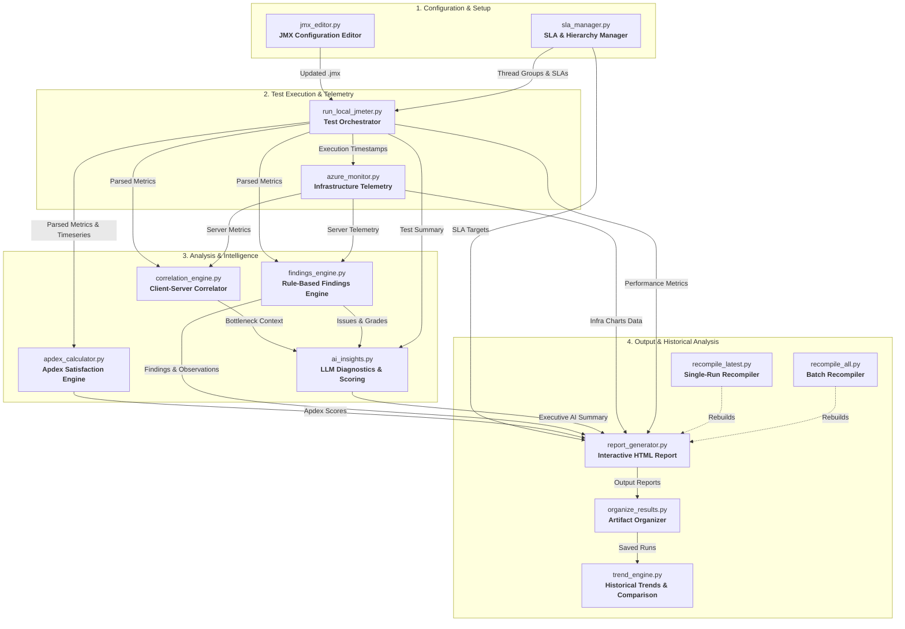

# Python Modules & Architecture Guide

This document provides a functional overview of the Python modules in `python_files/`, explaining the architecture, data pipeline, and each module's inputs and outputs from a functional perspective.

---

## 🏗️ Architecture & Pipeline Flow

The backend follows a **modular functional pipeline**. Test execution feeds into telemetry and parsing, which flows into analytics and rule engines, culminating in AI insights and interactive HTML reports.

---

## 📋 Module Catalog & Functional Details

| Module | Category | Primary Function |
| :--- | :--- | :--- |
| [`run_local_jmeter.py`](#1-run_local_jmeterpy) | Execution | Executes JMeter CLI tests, streams live JTL logs, and coordinates the post-test pipeline |
| [`report_generator.py`](#2-report_generatorpy) | Reporting | Generates self-contained interactive HTML dashboards with Chart.js charts and analytics |
| [`ai_insights.py`](#3-ai_insightspy) | Intelligence | Generates diagnostic insights, root-cause deductions, and performance scores via LLMs / rules |
| [`findings_engine.py`](#4-findings_enginepy) | Analytics | Evaluates statistical performance thresholds, chart observations, and automated recommendations |
| [`correlation_engine.py`](#5-correlation_enginepy) | Analytics | Cross-correlates client-side latency/TPS with server-side CPU/Memory/IOPS |
| [`sla_manager.py`](#6-sla_managerpy) | Configuration | Parses JMX hierarchies (Thread Groups, Samplers) and manages SLA threshold targets |
| [`jmx_editor.py`](#7-jmx_editorpy) | Configuration | Safely reads and updates user concurrency, ramp-up, and duration inside `.jmx` XML scripts |
| [`apdex_calculator.py`](#8-apdex_calculatorpy) | Analytics | Computes Apdex user satisfaction scores and ratings based on target thresholds ($T$ and $4T$) |
| [`azure_monitor.py`](#9-azure_monitorpy) | Telemetry | Collects server-side telemetry from Azure Monitor API or realistic local mock metrics |
| [`trend_engine.py`](#10-trend_enginepy) | Analytics | Analyzes multi-run historical trends, health scores, and generates side-by-side run comparisons |
| [`organize_results.py`](#11-organize_resultspy) | Utility | Migrates and organizes loose test outputs into structured timestamped run folders |
| [`recompile_latest.py`](#12-recompile_latestpy) | Utility | Recompiles the HTML report for the most recent run without re-running JMeter |
| [`recompile_all.py`](#13-recompile_allpy) | Utility | Batch re-parses JTLs and regenerates HTML reports for all past test runs |

---

### 1. `run_local_jmeter.py`
**Test Orchestrator & Execution Engine**
- **Functional Purpose:** Discovers the local Apache JMeter installation, launches the non-GUI test execution, tails `.jtl` output in real time for live UI feedback, parses final transaction logs, and triggers downstream analytics and reporting.
- **Inputs:**
  - `jmx_name`: Selected `.jmx` test script filename.
  - Concurrency parameters: Global (`users`, `duration`, `rampup`) or individual Thread Group configs.
  - Optional flags (e.g., custom run folder, live watcher enable/disable).
- **Outputs:**
  - Raw execution log (`.jtl` file) and runtime console logs.
  - Parsed performance data dictionary (`summary`, `labels`, `time_series`, `errors`, `display_labels`).
  - Automated triggers to run Azure monitoring, Correlation, AI Insights, and Report Generation.

---

### 2. `report_generator.py`
**Interactive Dashboard & HTML Report Generator**
- **Functional Purpose:** Assembles all performance metrics, SLA compliance tables, Apdex ratings, server metrics, Chart.js visualizations, and AI findings into a modern, standalone HTML report.
- **Inputs:**
  - `parsed`: Test summary, transaction-level metrics, error breakdown, and time-series data.
  - `azure_data`: Infrastructure telemetry metrics from `azure_monitor.py`.
  - `ai_insights`: AI executive summary, recommendations, and performance scoring.
  - `jmx_file`: Test script path for displaying hierarchical Thread Group trees.
- **Outputs:**
  - Self-contained HTML report saved in `Results/html/run_<timestamp>_report.html`.

---

### 3. `ai_insights.py`
**AI Diagnostics & Performance Scoring Engine**
- **Functional Purpose:** Analyzes test execution metrics and infrastructure telemetry to generate root-cause analysis, risk assessments, remediation steps, and an overall performance score (0–100). Supports Gemini API, GitHub Models, and deterministic rule-based analysis.
- **Inputs:**
  - `summary`: Overall test summary (TPS, error rate, average/90th percentile response time).
  - `labels`: Individual transaction statistics.
  - `infra`: Server-side resource utilization (CPU, memory, disk, network).
  - `findings_context`: Output from `findings_engine.py` for enriched context.
- **Outputs:**
  - AI Insights dictionary (Performance score & grade, executive summary, critical bottlenecks, root-cause findings, engineering recommendations).

---

### 4. `findings_engine.py`
**Rule-Based Performance Findings & Grading Engine**
- **Functional Purpose:** Evaluates deterministic performance rules against response times, error rates, throughput stability, and server saturation to produce categorized findings (Critical, High, Medium, Low) and chart observations.
- **Inputs:**
  - `summary`, `labels`, `time_series`: Parsed client-side performance metrics.
  - `infra`: Server infrastructure telemetry.
- **Outputs:**
  - Structured findings list with severity badges.
  - Chart-level observations (e.g., latency spikes, error correlations).
  - Remediation recommendations and overall performance health assessment.

---

### 5. `correlation_engine.py`
**Client-to-Server Metric Correlation Engine**
- **Functional Purpose:** Correlates client-side symptoms (high latency, degraded TPS, error bursts) with backend resource constraints (CPU saturation, Memory exhaustion, IOPS limits) to determine root cause location (Client vs. Network vs. Server).
- **Inputs:**
  - `parsed`: JMeter time-series and summary data.
  - `azure_data`: Server telemetry time-series and resource metrics.
- **Outputs:**
  - Correlation summary dictionary (bottleneck classification, saturated server components, concurrency impact analysis).

---

### 6. `sla_manager.py`
**SLA & JMX Hierarchy Manager**
- **Functional Purpose:** Parses `.jmx` XML structures to extract Thread Groups, Controllers, and Samplers. Manages and persists SLA targets (Response Time thresholds and 90th percentile limits) per transaction, and validates test compliance.
- **Inputs:**
  - JMX script file or path.
  - SLA configuration JSON files (`config/sla_targets.json` or project-specific SLA files).
- **Outputs:**
  - Hierarchical transaction tree representation (parent controller to child samplers).
  - SLA evaluation dictionary (Pass/Fail status per transaction against targets).

---

### 7. `jmx_editor.py`
**JMX XML Configuration Editor**
- **Functional Purpose:** Programmatically reads and modifies JMeter `.jmx` XML files to configure thread counts, ramp-up periods, test durations, and loop counts without manual XML editing.
- **Inputs:**
  - `jmx_path`: File path to the `.jmx` test script.
  - Target concurrency parameters (global or per-thread-group list).
- **Outputs:**
  - Updated `.jmx` test script on disk.
  - Thread group configuration dictionary for UI rendering.

---

### 8. `apdex_calculator.py`
**Apdex (Application Performance Index) Engine**
- **Functional Purpose:** Calculates Apdex user satisfaction scores based on customizable target response time thresholds ($T$). Categorizes requests into Satisfied ($RT \le T$), Tolerating ($T < RT \le 4T$), and Frustrated ($RT > 4T$ or Error).
- **Inputs:**
  - Response time data (raw data points or aggregated percentile metrics).
  - Threshold target $T$ (default: 1.5 seconds / 1500 ms).
- **Outputs:**
  - Apdex score ($0.00$ to $1.00$) and satisfaction grade (`Excellent`, `Good`, `Fair`, `Poor`, `Unacceptable`).
  - Apdex time-series breakdown for chart visualization.

---

### 9. `azure_monitor.py`
**Infrastructure Telemetry Collector**
- **Functional Purpose:** Collects server-side telemetry (App Service / VM metrics) for the exact duration of a test run. Supports querying the Azure Monitor REST API or parsing realistic mock telemetry for offline environments.
- **Inputs:**
  - `start_epoch`, `end_epoch`: Test execution start and end timestamps.
  - `run_id`: Unique run identifier.
- **Outputs:**
  - Infrastructure telemetry dictionary (CPU %, Memory %, Disk I/O, Network In/Out, HTTP Requests time-series).

---

### 10. `trend_engine.py`
**Historical Trends & Multi-Run Comparison Engine**
- **Functional Purpose:** Scans historical test run artifacts, groups runs by project and user story, computes health score trajectories, and generates side-by-side comparative analyses across selected runs.
- **Inputs:**
  - Historical run folders (`Results/runs/` and `Results/html/`).
  - Query filters: `project`, `user_story`, `transaction`, `run_ids`.
- **Outputs:**
  - Trend time-series datasets (response time drifts, error trends, throughput variations).
  - Side-by-side run comparison dataset and standalone comparison HTML dashboard.

---

### 11. `organize_results.py`
**Results Organization Utility**
- **Functional Purpose:** Scans the `Results/` directory for unorganized test output files (JTLs, JSONs, HTMLs) and sorts them into organized timestamped subdirectories under `Results/runs/run_<timestamp>/`.
- **Inputs:** Root `Results/` directory.
- **Outputs:** Structured file layout with cleaned top-level folders.

---

### 12. `recompile_latest.py`
**Latest Run Report Recompiler**
- **Functional Purpose:** Quickly regenerates the HTML report for the most recent test run using existing saved artifacts without having to re-execute the JMeter test.
- **Inputs:** Most recent run directory in `Results/runs/`.
- **Outputs:** Updated HTML report in `Results/html/`.

---

### 13. `recompile_all.py`
**Batch Historical Report Recompiler**
- **Functional Purpose:** Iterates over all historical test runs in `Results/runs/`, re-parses JTL logs, and rebuilds updated HTML reports with latest report templates and styling.
- **Inputs:** All run directories in `Results/runs/`.
- **Outputs:** Recompiled HTML reports for all past test executions.
